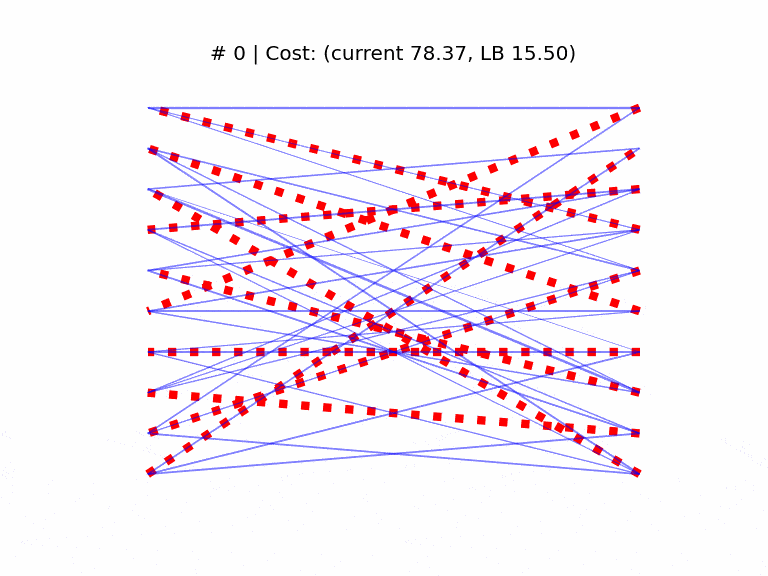

## minimum bipartite matching via Riemann optimization

<figure>

<figcaption>A sample run, with cost lower bound (LB) given by the combinatorial (Munkres) solution and corresponding solution in dashed red line. In d=10, the Birkhoff polytope has 3628800 corners so it's likely SGD got stuck in a local minimum.</figcaption>
</figure>

-----

Instead of a scipy one-liner ( [linear sum assignment](#assign) ), we take the panoramic route and formulate it as an optimization
problem over the manifold of doubly-stochastic matrices, hoping to end up in a corner of the [Birkhoff polytope](#birkhoff).

~~If it works I'll write a blog post about it~~ UPDATE: it works

### References

* <a href="#assign">https://en.wikipedia.org/wiki/Assignment_problem </a>
* <a href="#birkhoff">https://en.wikipedia.org/wiki/Doubly_stochastic_matrix </a>